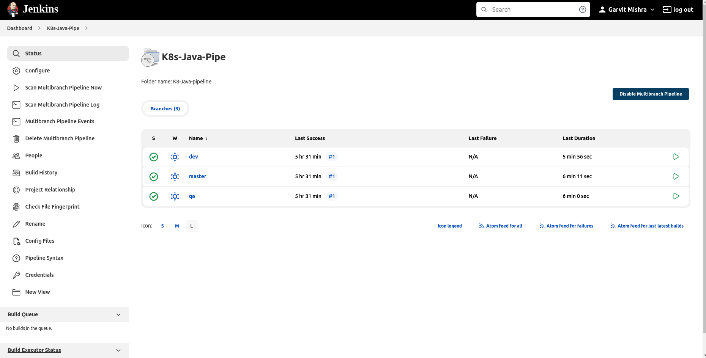
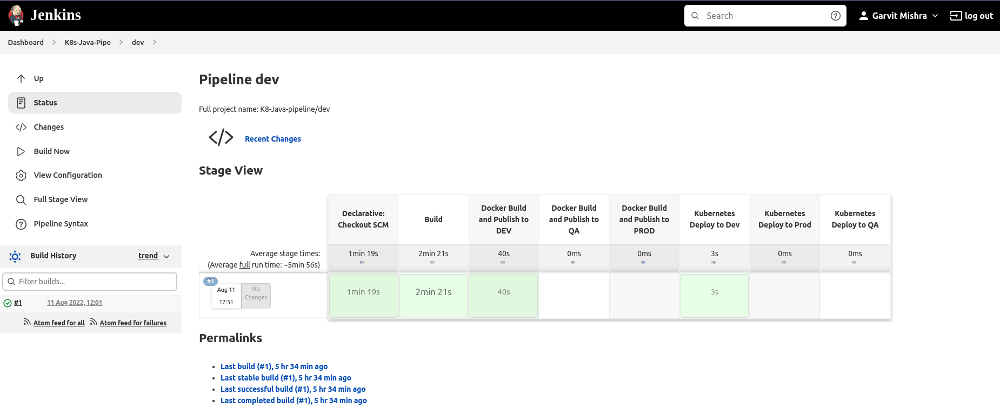
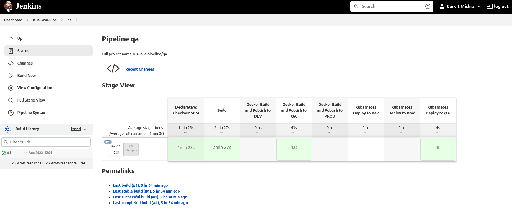
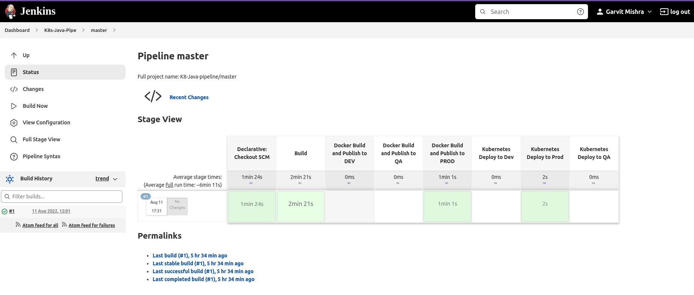
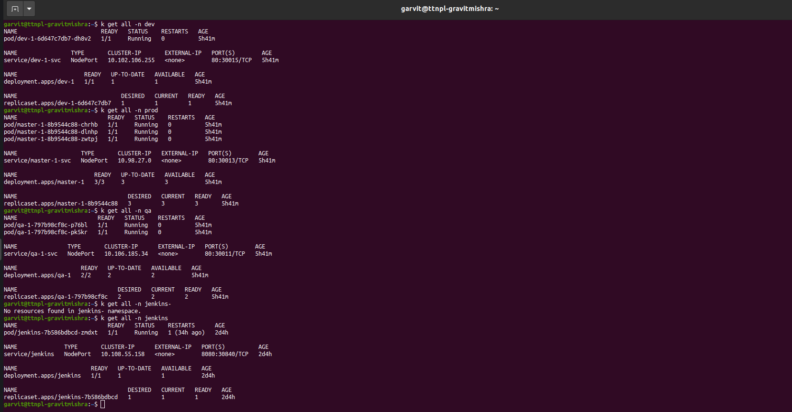
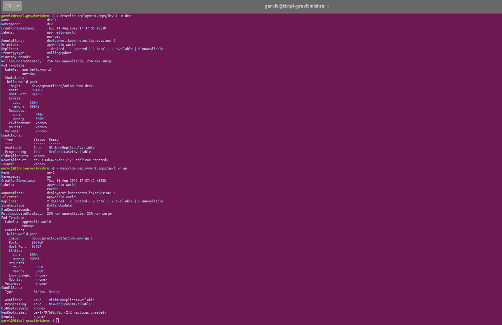
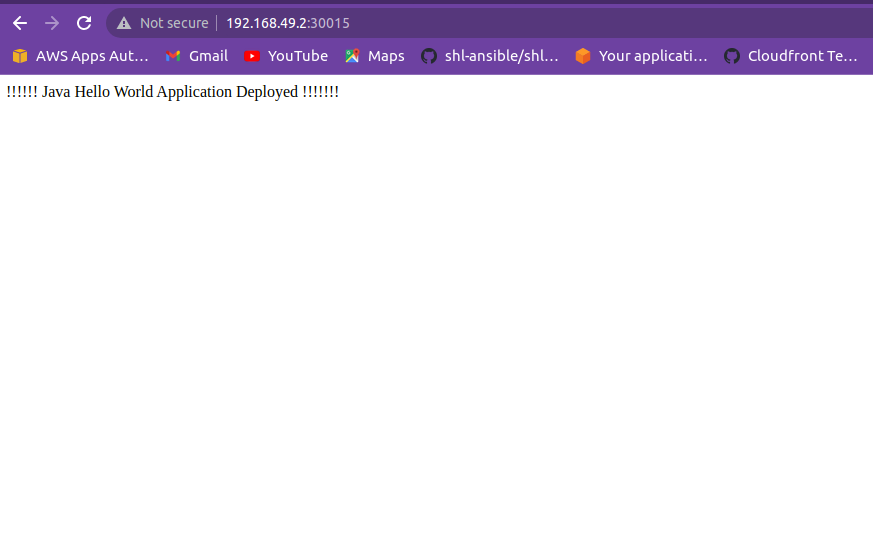

= Java Application Deployment in K8s 
:toc:
:toclevels: 3
:toc-placement!:

toc::[]

This project shows different recipes to run a Java EE application using Kubernetes.

== Problem Statement
Create 3 namespaces on Minikube cluster for the environments (Dev , QA , and Prod) in addition to Jenkins namespace.
Each environment namespace will have hello-world application POD deployed once Jenkins build being triggered for the relevant environment.
Jenkins namespace will have Jenkins POD deployed.


== Implemention Steps

=== Create Kubernetes Cluster

==== Using Minikube

This will create a one node development cluster.

. Download https://github.com/kubernetes/minikube/releases[latest minikube release]
. Download http://kubernetes.io/docs/getting-started-guides/minikube/#install-kubectl[latest kubectl]
. Move both binaries in the same directory and include that directory in the `PATH`.
. Start Kubernetes one node cluster:
+
  minikube start
+
Detailed instructions: http://kubernetes.io/docs/getting-started-guides/minikube/


=== Create namespaces for different envs

This section will explain how to create namespaces in minikube cluster as per problem statement.

. Create dev namespace in Minikube Cluster:
+
[source, text]
----
kubectl create namespace dev
namespace/dev created
----
+
. Create qa namespace in Minikube Cluster:
+
[source, text]
----
kubectl create namespace qa
namespace/qa created
----
+

. Create prod namespace in Minikube Cluster:
+
[source, text]
----
kubectl create namespace dev
namespace/dev created
----
+

. Create jenkins namespace in Minikube Cluster to run jenkins as pod:
+
[source, text]
----
kubectl create namespace jenkins
namespace/jenkins created
----
+
. Creating Jenkins Deployment/ServiceAccount/RoleBinding/ClusterRole in Jenkins namespace:
+
[source, text]
----
kubectl create -f jenkins-deployment.yaml -n jenkins
kubectl create -f jenkins-service.yaml -n jenkins
kubectl create serviceaccount jenkins -n jenkins
kubectl create rolebinding jenkins-admin-binding --clusterrole=admin --serviceaccount=jenkins:jenkins --namespace=jenkins
kubectl get services -n jenkins
NAME       TYPE        CLUSTER-IP       EXTERNAL-IP    PORT(S)           AGE
jenkins    NodePort    10.103.31.217    <none>         8080:32664/TCP    59s

Now we can access the Jenkins instance at 192.168.99.100:30104/
For reference Please refer https://www.jenkins.io/doc/book/installing/kubernetes/
----

=== Integration and Creation of Jenkins Pipeline

This section will explain how to integrate and create multibranch pipeline to deploy app on minikube cluster.
-Install necessary plugins like (Docker,Maven,KubernetesCLI,Kubernetes-Config)
-Manage Credentials in Jenkins and use as groovy variable in pipeline code (docker-registry-pass,github credentials,minikube cluster certificate creds)

==== For Detailed Steps refer below articles: 

```
https://www.jenkins.io/doc/book/pipeline/multibranch/
https://www.jenkins.io/doc/book/scaling/

```

=== Creating Helm Chart 

Helm Chart is created to deploy application in multiple environments keeping single configuration with dynamic values depending on env's.

. Install and Create Generic Chart:
+
```
curl https://baltocdn.com/helm/signing.asc | gpg --dearmor | sudo tee /usr/share/keyrings/helm.gpg > /dev/null
sudo apt-get install apt-transport-https --yes
echo "deb [arch=$(dpkg --print-architecture) signed-by=/usr/share/keyrings/helm.gpg] https://baltocdn.com/helm/stable/debian/ all main" | sudo tee /etc/apt/sources.list.d/helm-stable-debian.list
sudo apt-get update
sudo apt-get install helm
helm create hello-world
hello-world/
├── .helmignore   # Contains patterns to ignore when packaging Helm charts.
├── Chart.yaml    # Information about your chart
├── values.yaml   # The default values for your templates
├── charts/       # Charts that this chart depends on
└── templates/    # The template files
    └── tests/    # The test files
```
+
. Creating Dynamic Values.yaml files depending on environment:

```
vim values-dev.yaml
vim values-qa.yaml
vim values-prod.yaml
```
=== Creating JenkinsFile to run complete pipeline:

Declarative JenkinsFile has been written with few conditional, which in turn trigger job accordingly.

==== Jenkinsfile:

```
pipeline {
    environment {
        
        NAME = "${env.BRANCH_NAME }-${env.BUILD_ID}"
        VERSION = "${env.BUILD_ID}"
        DOMAIN = 'localhost'
        REGISTRY_DEV = 'devopspractice60/demo-dev'
        REGISTRY_QA = 'devopspractice60/demo-qa'
        REGISTRY_PROD = 'devopspractice60/demo-prod'

    }
    agent {
        kubernetes {
            defaultContainer 'jnlp'
            yamlFile 'build.yaml'
        }
    }
    stages {
        stage('Build') {
            steps {
                container('maven') {
                    sh 'mvn package'
                }
            }
        }
        
        stage('Docker Build and Publish to DEV') {
            when {
                 branch "dev"
            }
            steps {
                container('docker') {
                        withCredentials([string(credentialsId: 'pass_registry', variable: 'docker_pass')]) {
                        sh "docker login -u devopspractice60 -p $docker_pass" 
                        sh "docker build -t ${REGISTRY_DEV}:${VERSION} ."   
                        sh "docker push ${REGISTRY_DEV}:${VERSION}"
                        sh "docker rmi ${REGISTRY_DEV}:${VERSION}"
                     }
                    }
                }
            }

        stage('Docker Build and Publish to QA') {
            when {
                 branch "qa"
            }
            steps {
                container('docker') {
                        withCredentials([string(credentialsId: 'pass_registry', variable: 'docker_pass')]) {
                        sh "docker login -u devopspractice60 -p $docker_pass" 
                        sh "docker build -t ${REGISTRY_QA}:${VERSION} ."   
                        sh "docker push ${REGISTRY_QA}:${VERSION}"
                        sh "docker rmi ${REGISTRY_QA}:${VERSION}"
                     }
                    }
                }
            }

        stage('Docker Build and Publish to PROD') {
            when {
                 branch "master"
            }
            steps {
                container('docker') {
                        withCredentials([string(credentialsId: 'pass_registry', variable: 'docker_pass')]) {
                        sh "docker login -u devopspractice60 -p $docker_pass" 
                        sh "docker build -t ${REGISTRY_PROD}:${VERSION} ."   
                        sh "docker push ${REGISTRY_PROD}:${VERSION}"
                        sh "docker rmi ${REGISTRY_PROD}:${VERSION}"
                     }
                    }
                }
            }        
        
        stage('Kubernetes Deploy to Dev') {
            when {
                 branch "dev"
            }
            steps {
                container('helm') {
                    sh "helm upgrade --install --force -f ./values-dev.yaml --set app.name=${NAME} --set app.imagetag=${VERSION}  ${NAME} ./helm"
                }
            }         
        }

        stage('Kubernetes Deploy to Prod') {
            when {
                 branch "master"
            }
            steps {
                container('helm') {
                    sh "helm upgrade --install --force -f ./values-prod.yaml --set app.name=${NAME} --set app.imagetag=${VERSION}  ${NAME} ./helm"
                }
            }         
        }
        stage('Kubernetes Deploy to QA') {
            when {
                  branch "qa"
            }
            steps {
                container('helm') {
                    sh "helm upgrade --install --force -f ./values-qa.yaml --set app.name=${NAME} --set app.imagetag=${VERSION}  ${NAME} ./helm"
                }
            }         
        }
    }
}
```
== Solution Summary
This section refers summary of complete CI-CD Implemention above problem statement.Below steps will be helpful in running this project.

. Prerequisite [Complete Implemention Setup]

. Cloning Project Repo:
+
[source, text]
----
git clone https://github.com/garvit-ttn/docker-k8s-demo.git
----
+
. Jenkins Job Triggered Automatically upon pushing changes to Git Repo:

==== Demo Output Images:

.MultiBranch Pipeline



.Dev Branch Pipeline Output



.QA Branch Pipeline Output



.PROD Branch Pipeline Output



.Application Deployment Status



.Application CPU Request on namespace



.Application Running Status


